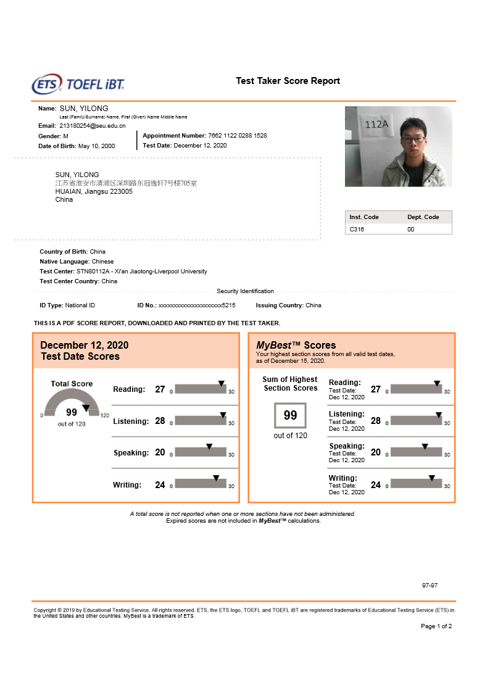

# Welcome!

Welcome to Yilong Sun's Personal Website!

My name is Yilong and I am a junior undergraduate at School of Information Science and Engineering in Southeast University. Before I transferred to School of Information Science and Engineering, I studied in School of Physics for one year.

My research interests lie in design of analog and mixed signal circuits. I've done some work on the wideband reconfigurable anti-interference receiver and software defined radio simulation toolbox.

# CV
***

Education Experience, Research Results and Professional Skills.

***
## _Education_

1)  __School of Physics__

  * Duration: Sep 2018-Jun 2019

  * Relevant Course: Calculus(94), Optics(98), Electromagnetism(94), Programming and Algorithm(98)
  
  * I took courses in optics and electromagnetics in the School of Physics. These two courses helped me develop my ability to think logically and gave me an advantage over others in understanding complex concepts. 

2)  __School of Information Science and Engineering__

  * Duration: Sep 2019-Jun 2022
  
  * Relevant Courses: Partial Differential Equations(96), Physics II(100), __Fundamental of Circuits(99), Digital and Logic Circuits(96), Analog Integrated Circuits(95),__ Electromagnetic Wave and Electromagnetic Field(97), Signals and Systems(93), Microcomputer Systems and Interfaces(94)
  
  * I took several courses related to circuits here, which gave me a firm grounding in the analysis and design of MOS and bipolar analog integrated circuits and laid the foundation for my future work in the laboratory. 

## _Researches and Projects_

1) __Design of Wideband Reconfigurable Anti-Interference Receiver__

 * Advisor: __Fengyi Huang__, Professor at School of Information Science and Engineering, Southeast University
 
 * Studied and applied the structures of __transceiver and anti-interference technique__
 
 * Built quantitative relationships between the anti-interference performance and noise figure index of the circuits
 
 * Tested different structures like __analog front-ends with n-path filter, mixer-first, etc.__ to meet the specifications for an improvement on preexisting models
 
 * Patent pending on tape and paper from the research results
 
 * I learned in the lab to use __Cadence ADE__ to test the performance of the circuits and adjust the circuit structure and transistor parameters based on the simulation results.

2) __Design of Software Defined Radio Simulation Toolbox__

 * Designed a graphical user interface of Software Defined Radio (SDR) with C++
 
 * Wrote a program utilizing deep learning algorithms to identify the modulation mode of the signal according to the time domain and frequency domain waveform of the input signal
 
 * Used All-Digital Phase-Locked Loop technology to identify the center frequency of the input signal

***

The download link for CV is __https://github.com/213180254syl/SunYilong.github.io/blob/main/CV_Yilong%20Sun.pdf__

***

## _Professional Skills_

 * Circuit design: using __Cadence Virtuoso Schematic Editor, Virtuoso Analog Design Environment (ADE)__ to design and simulate analog and RF circuits; utilizing Simulink in MATLAB to model communication systems.
 * Programming: having basic grasp of data structure, high-level programming language including __C++, Java and MATLAB__.

# TOEFL Score

***

Ability to use English in an academic environment

***

My score on TOEFL test in December 2020 was 99.
- Reading:     27
- Listening:   28
- Speaking:    20
- Writing:     24

***

Preview my CV and TOEFL Score Report

***

***Image of CV***

***Image of TOEFL Score Report***

